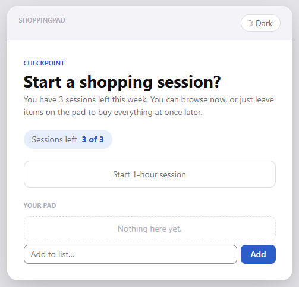
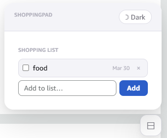

# ShoppingPad

A simple notepad overlay for shopping sites. Instead of buying items one by one across several days, you put them on the pad and close the tab. When you actually need to shop, you do it all at once. It saves a lot of time and cuts down on delivery fees.

## Screenshots

### Overlay (instead of shopping)

### Widget (during the shopping)

## Installation

1. Install the [Tampermonkey](https://www.tampermonkey.net/) extension for your browser.
2. Install the script by paste the code into a new Tampermonkey script.

### Customizing for other sites
The script is currently set up to run on Amazon, but the code is entirely generic. You can use it on eBay, grocery sites, or anywhere else you shop.

To add a new site:

1. Open your Tampermonkey dashboard and click to edit this script.

1. At the top, add a new match line with your site's URL. For example:
   ` // @match https://ebay.com/*`

1. Save the script.
